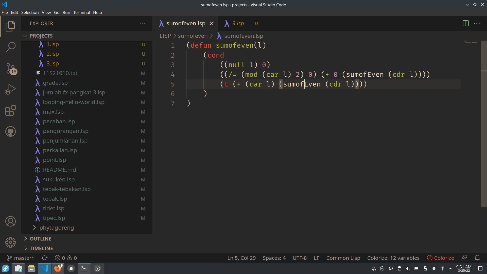

# SUM OF EVEN

Ini adalah program yang dibuat dengan bahasa pemrograman LISP, dengan tujuan sebagai bahan pembelajaran dan untuk mencari jumlah dari bilangan genap yang berada dalam suatu list. Program ini dibuat dengan prinsip rekursif.

Berikut link video pembuatannya: <button><a href="https://youtu.be/4VIibPI1XDo">Klik Disini </a></button>
## How to use?

Berikut cara menggunakannya:
1. Buka CLISP
2. Load file ini
3. Ketikkan
    ```
    (sumofeven '(list))
    ```
    Contohnya
    ```
    (sumofeven '(1 2 3 4 5 6 7 8 9 10))
    ```
4. Tekan enter.
5. **Boom!!** Hasilnya pun akan muncul.



## <b>About Me</b>

I'm a student at Del Institute of Technology. <br>
Bachelor of Informatics study program. <br>


<button><a href="https://www.instagram.com/gabrielhtg77/">My Instagram</a></button>
<br>
<button><a href="https://www.del.ac.id/">Institut Teknologi Del</a></button>